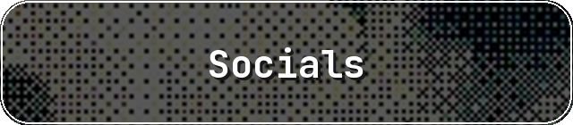
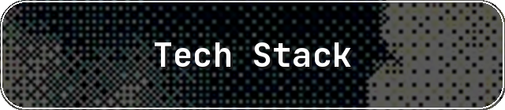
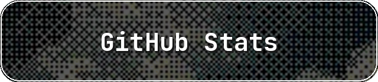

# About Me
I'm a CSE undergrad in IUT -- who finds joy in turning ideas into code.  Currently learning and writing in C, C++, and Python. I wish to expand my knowledge mostly in AI and ML. But let's see how it goes. You'll usually find me with a cup of coffee nearby, a book waiting to be finished, and my eyes drifting toward the sky whenever i need a moment to think. I love building things, learning something new every day, and finding beauty in both elegant code and quiet sunsets. My social life is on a temporary loading screen, but you can still find me around the internet if you're curious. :)

   

            

 
 

---

<!-- Proudly created with GPRM ( https://gprm.itsvg.in ) -->

<!--
**arpitaonekbhalo/arpitaonekbhalo** is a ✨ _special_ ✨ repository because its `README.md` (this file) appears on your GitHub profile.

Here are some ideas to get you started:

- 🔭 I’m currently working on ...
- 🌱 I’m currently learning ...
- 👯 I’m looking to collaborate on ...
- 🤔 I’m looking for help with ...
- 💬 Ask me about ...
- 📫 How to reach me: ...
- 😄 Pronouns: ...
- ⚡ Fun fact: ...
-->
